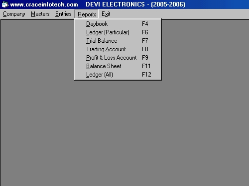

## Accounting Software

I have developed Accounting Software in Visual Basic 6 and Foxpro Database while I started my career in Software development ( Around 1997).

At that time , I have published this code in public forum.

As this is my intial coding, I can say it is a working code, but not efficient code following all best practices.

It served the purpose at that time.

Actually , I have developed another software based on this code base for Milk Societies near Thirunelveli, Tamilnadu, India ( 4 societies) , And I am very proud to say that the application developed by me is working for more than 15 years without any issues ( They have changed their Computer hardware multiple times with different Windows OS versions, but still they are running it for their day to day use , without any issues.)

### Description

Simple and efficient Financial Accounting Software for small businesses.

With Multi company and muliple financial year support. Instant Reports. No codes required for account folios. Built in back up and restore facilty .

zip file contains complete source code.

This source code contains 35 forms and 2 modules.

For Database access, I have used ADO in this application. Database can be any odbc data source.

You can use Foxpro, Microsoft Access,SQL Server or Oracle. Database Table structures are published. All path settings are clearly explained.

* How to create database files folder?

* How to create report files folder?

* How to extract Visual basic source files?

* How to extract the database files?

* How to set up the ODBC Data Source ?

* How to set the date format in regional settings?

* How to open this project in visual basic ?

* How to set the project properties ?

* How to set the project components?

* How to set the project references?

* How to understand and trace the Source code ?
 
### More Info
 
Entry of Daily transactions alone is enough

Simple Understanding of Accounting knowledge and windows familiarity

All reports from Daybook, Ledger, Trial Balance,to Balance sheet.

